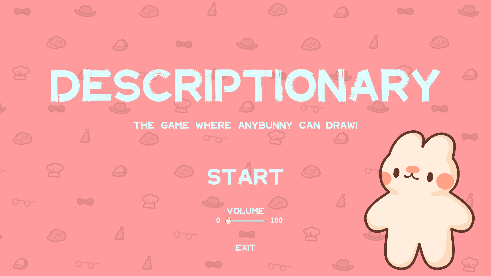
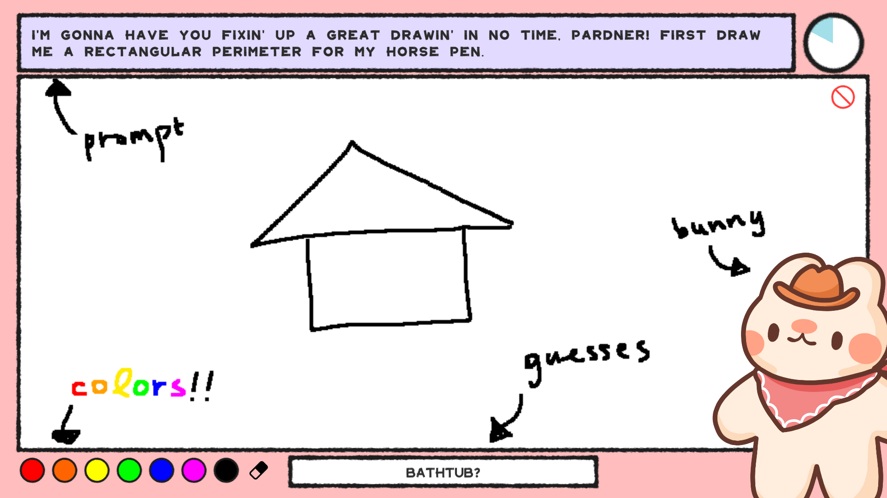

## Post-Jam Update:
Thank you so much to everyone who has played and rated Descriptionary! A quick update from us: the game is now playable in browser! Descriptionary is best enjoyed in Full Screen and with Hardware Acceleration On in browser settings, so if your game is lagging a little that might just fix it! 

We're so grateful for all the support the GMTK community has given us, it's absolutely unreal to see our game be featured in the video alongside many other amazing games. As many have commented, this game was originally designed for a multiplayer experience, and we've decided to continue development to work towards that goal! Stay tuned for more updates from us in the future C:

# It’s Descriptionary - The game where anybunny can draw!

Descriptionary is like a classic drawing board game, but the roles are reversed; instead of drawing something based on a prompt while others guess what you’re drawing, you’re given a vague description of something and then you have to guess what you were supposed to be drawing!

Join our bunny-themed cast featuring a wide variety of characters who all need your help! Try to navigate their individual mannerisms in order to depict what they’re trying to describe, all under a time limit.

## Controls: 

- Choose a colour from the bottom-left corner of the screen, then click and drag your mouse along the canvas to draw. 
- If you make a mistake, just use the eraser tool next to the colours, or restart entirely using the clear tool in the top-right corner of your canvas. 
- You read drawing prompts on the top of your screen, and you can use the arrow keys on your keyboard to scroll through all of the dialogue from each bunny. 
- When you think you know what you’re drawing, click on the ‘Guess Here’ textbox, input your answer, and hit enter. 
- If you’re right, you win! If you’re wrong, you can keep guessing until the timer runs out. 
- If you run out of time, you can carry on to the next level -  anybunny can beat this game!

## Credits:
Programmers: Momo, Ryn

Game Designer: Kamii

Writer: Baron

Artist: Cali

Additional Support: Dirt, Chorby, Egg, YoloNinja, Colin, Robbity 

Music From: DDBY, Akito Bass

